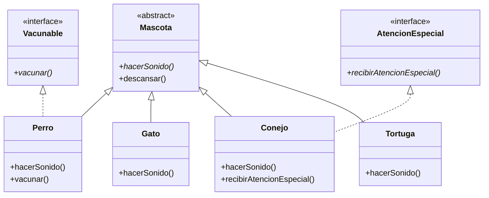

## Reflexión: ¿Por qué interfaces y no más herencia?
Podemos decir que en este diseño, usar interfaces para comportamientos adicionales es mejor porque se aplica:
Flexibilidad: Una clase que puede implementar múltiples interfaces pero solo puede heredar de una clase. Por ejemplo, Perro puede ser Vacunable y también podríamos añadirle otras interfaces sin problemas.
No acoplamiento fuerte: Las interfaces definen contratos sin implementación, evitando la fragilidad de las jerarquías de herencia profundas.
Principio de segregación de interfaces: Los clientes solo dependen de los métodos que necesitan. No hay que implementar métodos innecesarios.
Mantenimiento: Añadir nuevas capacidades (como Vacunable) no requiere modificar la jerarquía de clases existente.
Polimorfismo transversal: Podemos tratar objetos de clases no relacionadas por su capacidad (todo lo Vacunable), no solo por su tipo en la jerarquía.
Evita el problema del "diamante": En Java no hay herencia múltiple de clases, pero sí de interfaces.
Cohesión: Cada interfaz representa un comportamiento específico y bien definido.

# Sistema de Gestión Veterinaria 🐾

Un sistema orientado a objetos para gestionar mascotas en una clínica veterinaria, implementando herencia, interfaces y polimorfismo en Java.

## Características principales

- 🐶 Modelado de diferentes tipos de mascotas (Perro, Gato, Conejo, Tortuga)
- 🔊 Registro de sonidos característicos de cada animal
- 🏥 Gestión de necesidades especiales (AtencionEspecial)
- 💉 Sistema de vacunación (Vacunable)
- 🛌 Comportamiento común de descanso post-consulta

## Diagrama de Clases UML

## Estructura del Proyecto:

src/
└── clinicaveterinariapoo/
    ├── Mascota.java
    ├── AtencionEspecial.java
    ├── Vacunable.java
    ├── Perro.java
    ├── Gato.java
    ├── Conejo.java
    ├── Tortuga.java
    └── ConsultaVeterinaria.java

## Requisitos:
- Java JDK 11 o superior
- Maven (opcional para gestión de dependencias)

## Cómo ejecutar:
Clona el repositorio:
git clone https://github.com/tu-usuario/clinica-veterinaria-poo.git

Compila y ejecuta:
cd clinica-veterinaria-poo/src
javac clinicaveterinariapoo/*.java
java clinicaveterinariapoo.ConsultaVeterinaria

## Ejemplo de salida:

El perro hace: ¡Guau guau!
La mascota está descansando.
Vacunando al perro contra la rabia.

El gato hace: ¡Miau miau!
La mascota está descansando.

El conejo hace: Sniff sniff
La mascota está descansando.
El conejo está recibiendo terapia postquirúrgica.

La tortuga hace: ... (silencio)
La mascota está descansando.

## Principios POO aplicados:
Herencia (Relación Mascota - Subclases)
Polimorfismo (método hacerSonido())
Encapsulamiento
Principio de sustitución de Liskov
Segregación de interfaces
Composición sobre herencia

## Licencia:
[BRANDON JEREMIAS SAJQUIY BCOH - 7590-21-1427]
